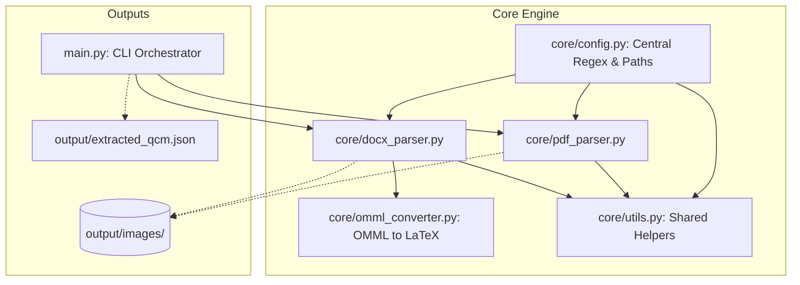

# 🧬 MedExtract-API - Extraction Core (Épique 01)

**MedExtract-API** est une pipeline d'extraction de haute précision conçue pour automatiser la conversion de banques de QCM médicales (depuis des fichiers Word `.docx` et PDF complexes) vers une base de données structurée au format JSON. 

Ce système repose entièrement sur des parsers physiques et logiques robustes et déterministes (sans dépendance à des API LLM externes payantes ou instables), garantissant **l'intégrité scientifique totale** des énoncés, des formules biologiques (LaTeX) et des images médicales associées.

---

## 🏗️ Architecture du Projet

Le projet adopte une architecture modulaire propre et découplée pour éviter tout code spaghetti et faciliter les extensions futures (comme l'implémentation de l'API REST FastAPI dans l'Épique 02).



### 📂 Structure des fichiers du Workspace

*   `core/` : Contient le cœur algorithmique de la pipeline.
    *   [config.py](file:///c:/Users/redab/Desktop/ProjetWordMedicale/core/config.py) : Centralisation des configurations de dossiers, des journaux (logs) et surtout des **Regex de détection** (généralisation).
    *   [utils.py](file:///c:/Users/redab/Desktop/ProjetWordMedicale/core/utils.py) : Fonctions utilitaires (nettoyage UTF-8, extraction de la sémantique de correction, parsing en ligne d'options multiples).
    *   [omml_converter.py](file:///c:/Users/redab/Desktop/ProjetWordMedicale/core/omml_converter.py) : Convertisseur récursif XML des formules mathématiques/biologiques Word (OMML) vers la notation standard LaTeX.
    *   [docx_parser.py](file:///c:/Users/redab/Desktop/ProjetWordMedicale/core/docx_parser.py) : Moteur d'extraction DOCX (ZipFile + XML relations + extraction zippée d'images).
    *   [pdf_parser.py](file:///c:/Users/redab/Desktop/ProjetWordMedicale/core/pdf_parser.py) : Moteur d'extraction PDF (PyMuPDF + Ancrage spatial géométrique des illustrations + auto-wrap de correction).
*   `QCM Medicale/` : Dossier d'entrée contenant les documents sources (.docx et .pdf).
*   `output/` : Contient les résultats de l'extraction.
    *   `images/` : Toutes les illustrations médicales extraites (images haute définition, nommées de manière unique par hash stable).
    *   [extracted_qcm.json](file:///c:/Users/redab/Desktop/ProjetWordMedicale/output/extracted_qcm.json) : Base de données finale de **583 questions validées** avec **0 avertissement structurel**.
*   `main.py` : Script d'entrée unifié de la pipeline (CLI).
*   `Epic/` : Documentation d'accompagnement de la pipeline (Tasklist, plan d'implémentation, rapport de clôture d'Épique).

---

## 🛠️ Fonctionnalités Clés & Algorithmes

### 1. Ancrage Spatial d'Images (PDF)
Le parser PDF utilise une heuristique de proximité géométrique basée sur les coordonnées physiques de l'image (`bbox`) fournies par PyMuPDF :
*   L'image est extraite au format natif (.png, .jpeg).
*   L'algorithme identifie le bloc de texte le plus proche situé **immédiatement en dessous** de l'image sur l'axe vertical (ordonnée $y_0 \ge y_{image}$).
*   Un placeholder unique du type `[[IMG_hash_P{page}_I{index}]]` est alors injecté de manière linéaire dans le texte.

### 2. Traducteur OMML vers LaTeX
Word encode ses formules dans une structure XML complexe (`<m:oMath>`). Le script analyse récursivement ces balises sans dépendance externe :
*   Les balises d'exposant `<m:sSup>` sont converties en `base^{exposant}`.
*   Les balises d'indice `<m:sSub>` sont converties en `base_{indice}` (par exemple $PaO_2$ ou $H_2O$).
*   Les fractions `<m:f>` sont écrites sous forme de divisions claires `(numérateur/dénominateur)`.

### 3. Résilience et Généralisation des Patrons (Patterns Configuration)
Pour garantir que le système s'adapte à de nouvelles banques d'examens sans modifications de code, toutes les expressions régulières (Regex) sont déportées dans `core/config.py` :
*   `CASE_START_REGEX` : Capture les en-têtes de cas cliniques (ex: `"Cas clinique N°1:"`).
*   `QUESTION_START_REGEX` : Capture les numéros de début de question (ex: `"12."`, `"1-"`).
*   `OPTION_LOOSE_PATTERN` : Identifie les options isolées renvoyées à la ligne (ex: `"A."`).
*   `OPTION_PARSE_PATTERN` : Découpe les lignes d'options compactées horizontalement.

---

## 🚀 Utilisation de la Pipeline

### Prérequis
*   Python 3.13+
*   Dépendances listées dans l'environnement virtuel local `.venv/` (`PyMuPDF`, `lxml`, `python-docx`).

### Lancer l'extraction globale (par défaut)
Pour exécuter l'extraction sur l'intégralité des 14 fichiers du dossier `QCM Medicale` :
```bash
.venv\Scripts\python.exe main.py
```

### Lancer l'extraction sur un fichier spécifique
Vous pouvez spécifier un seul fichier DOCX ou PDF à l'aide de l'argument `--file` :
```bash
.venv\Scripts\python.exe main.py --file "QCM Medicale/Residanat-2025.pdf"
```

### Forcer une catégorie spécifique
Par défaut, la catégorie médicale est automatiquement déduite du nom de fichier (ex: *Cardiologie*, *Résidanat*, *Hépato-Gastro-Entérologie*). Vous pouvez forcer une catégorie via l'argument `--category` :
```bash
.venv\Scripts\python.exe main.py --file "QCM Medicale/Ex 01.docx" --category "Endocrinologie"
```

---

## 📈 Métriques et Résultats Actuels

La pipeline a été testée et validée avec succès sur les **14 examens réels** du corpus d'entrée :
*   **Total de questions extraites** : **583**
*   **Total de questions validées structurellement** : **583 / 583**
*   **Nombre de warnings structurels** : **0 🟢**
*   **Modèle de sortie JSON** : Entièrement conforme aux spécifications (contient les énoncés nettoyés, les typologies de questions `SINGLE_CHOICE`, `MULTIPLE_CHOICE` ou `K_TYPE`, l'intégrité de la logique positive/négative, les liaisons exactes 1-à-1 avec les grilles de corrections et commentaires explicatifs détaillés).
