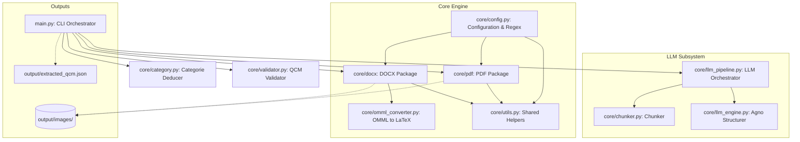
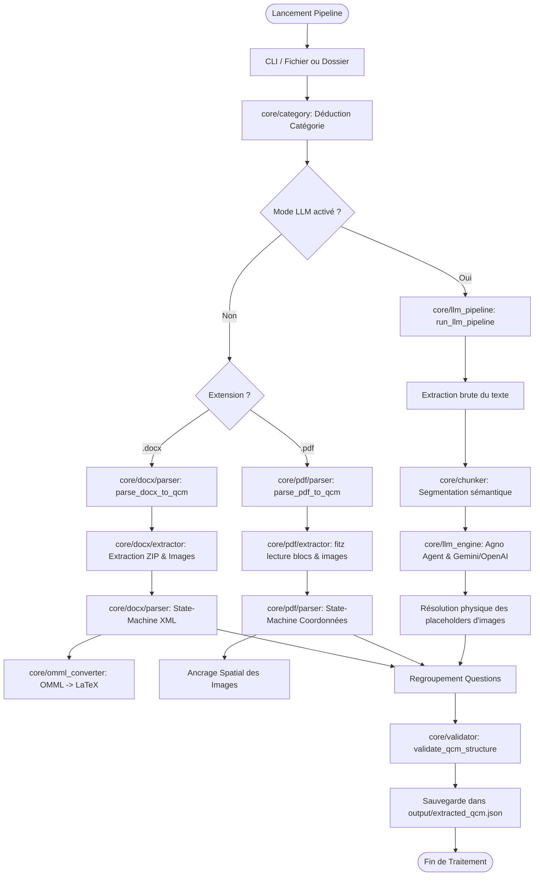
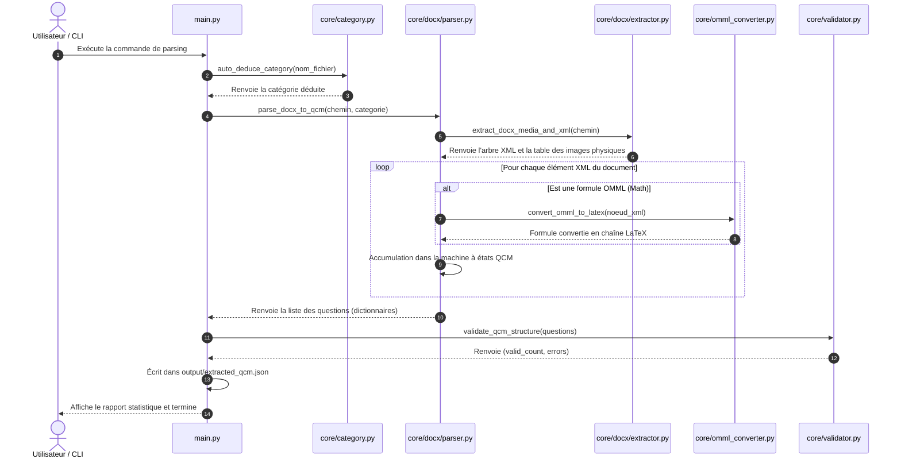

# 🧬 MedExtract-API - Extraction Core (Épique 01 & 02)

**MedExtract-API** est une pipeline d'extraction de haute précision conçue pour automatiser la conversion de banques de QCM médicales (depuis des fichiers Word `.docx` et PDF complexes) vers une base de données structurée au format JSON. 

Ce système repose sur une architecture découplée respectant le principe de responsabilité unique (SRP), combinant des parsers déterministes par règles hors-ligne et un moteur sémantique basé sur des agents LLM (Agno) pour garantir l'intégrité totale des énoncés, des formules biologiques (LaTeX) et des illustrations médicales.

---

## 🏗️ Architecture du Projet

Le projet adopte une architecture modulaire propre et découplée pour isoler les tâches d'extraction physique des données de la logique métier (parsing des QCM et structuration).



---

## 🔍 Logique Interne des Services

Chaque module au sein de `core/` répond à une responsabilité unique :

### 1. [main.py](file:///c:/Users/redab/Desktop/ProjetWordMedicale/main.py) (CLI Orchestrator)
*   **Rôle** : Point d'entrée de l'application et orchestrateur de haut niveau.
*   **Logique** : Gère l'analyse des arguments en ligne de commande (CLI), sélectionne les fichiers cibles, gère la déduction ou l'écrasement de catégorie, choisit le mode d'extraction (par règles ou IA), appelle le validateur et persiste le JSON final.

### 2. [core/docx](file:///c:/Users/redab/Desktop/ProjetWordMedicale/core/docx) (DOCX Package)
*   **[core/docx/extractor.py](file:///c:/Users/redab/Desktop/ProjetWordMedicale/core/docx/extractor.py)** : Ouvre l'archive ZIP du document Word, lit les relations d'images (`document.xml.rels`), extrait physiquement les binaires d'images vers le dossier de destination et convertit le balisage OMML en LaTeX en appelant le convertisseur.
*   **[core/docx/parser.py](file:///c:/Users/redab/Desktop/ProjetWordMedicale/core/docx/parser.py)** : Implémente la machine à états de parsing. Il boucle séquentiellement sur les paragraphes et les cellules de tableaux de corrections pour assembler les QCMs.

### 3. [core/pdf](file:///c:/Users/redab/Desktop/ProjetWordMedicale/core/pdf) (PDF Package)
*   **[core/pdf/extractor.py](file:///c:/Users/redab/Desktop/ProjetWordMedicale/core/pdf/extractor.py)** : Utilise PyMuPDF (`fitz`) pour effectuer une extraction géométrique spatiale des blocs de texte et extrait physiquement les images intégrées.
*   **[core/pdf/parser.py](file:///c:/Users/redab/Desktop/ProjetWordMedicale/core/pdf/parser.py)** : Reconstruit la structure logique du QCM à partir des positions spatiales du texte et parse les explications de corrections en fin de document.

### 4. [core/llm_pipeline.py](file:///c:/Users/redab/Desktop/ProjetWordMedicale/core/llm_pipeline.py) (LLM Subsystem Orchestrator)
*   **Rôle** : Orchestre le flux de traitement par Intelligence Artificielle.
*   **Logique** : Découpe le texte extrait via [core/chunker.py](file:///c:/Users/redab/Desktop/ProjetWordMedicale/core/chunker.py), soumet les blocs à l'agent IA structuré de [core/llm_engine.py](file:///c:/Users/redab/Desktop/ProjetWordMedicale/core/llm_engine.py), convertit les objets Pydantic en dictionnaires natifs et résout les placeholders d'images avec les extensions appropriées.

### 5. [core/category.py](file:///c:/Users/redab/Desktop/ProjetWordMedicale/core/category.py) (Category Deducer)
*   **Rôle** : Déduction de spécialité médicale.
*   **Logique** : Analyse le nom du fichier source à l'aide de correspondances de mots-clés prédéfinis pour lui attribuer sa catégorie (ex: Pneumologie, Cardiologie).

### 6. [core/validator.py](file:///c:/Users/redab/Desktop/ProjetWordMedicale/core/validator.py) (QCM Validator)
*   **Rôle** : Validation de la conformité du modèle.
*   **Logique** : Inspecte la structure de chaque question extraite. Vérifie la présence des champs obligatoires, la non-vacuité des options, la validité de la clé de correction et la cohérence des questions de type K-TYPE.

### 7. [core/omml_converter.py](file:///c:/Users/redab/Desktop/ProjetWordMedicale/core/omml_converter.py) (MathML to LaTeX)
*   **Rôle** : Traducteur de formules scientifiques.
*   **Logique** : Analyse récursivement l'arbre XML des balises Office Math Markup Language (OMML) de Word et le convertit en chaînes LaTeX standard (indices, exposants, fractions).

### 8. [core/utils.py](file:///c:/Users/redab/Desktop/ProjetWordMedicale/core/utils.py) (Shared Helpers)
*   **Rôle** : Fonctions d'aide transversales.
*   **Logique** : Fournit le nettoyage de chaînes UTF-8, le hachage stable de fichiers et le découpage de lignes d'options multiples (inline options).

---

## 📊 Diagrammes de Scénarios et Flux

### 1. Diagramme de Flux de Traitement d'un Document
Ce diagramme montre le cheminement de traitement d'un fichier du début à la fin de la pipeline :



### 2. Diagramme de Séquence de l'Extraction
Ce diagramme détaille la séquence des appels lors de l'extraction par règles d'un fichier DOCX :



---

## 🛠️ Fonctionnalités Clés & Algorithmes

### 1. Ancrage Spatial d'Images (PDF)
Le parser PDF utilise une heuristique de proximité géométrique basée sur les coordonnées physiques de l'image (`bbox`) fournies par PyMuPDF :
*   L'image est extraite au format natif (.png, .jpeg).
*   L'algorithme identifie le bloc de texte le plus proche situé **immédiatement en dessous** de l'image sur l'axe vertical (ordonnée $y_0 \ge y_{image}$).
*   Un placeholder unique du type `[[IMG_hash_P{page}_I{index}]]` est alors injecté de manière linéaire dans le texte pour référencer l'image.

### 2. Traducteur OMML vers LaTeX
Word encode ses formules dans une structure XML complexe (`<m:oMath>`). Le script [core/omml_converter.py](file:///c:/Users/redab/Desktop/ProjetWordMedicale/core/omml_converter.py) analyse récursivement ces balises :
*   Les balises d'exposant `<m:sSup>` sont converties en `base^{exposant}`.
*   Les balises d'indice `<m:sSub>` sont converties en `base_{indice}` (par exemple $PaO_2$ ou $H_2O$).
*   Les fractions `<m:f>` sont écrites sous forme de divisions claires `(numérateur/dénominateur)`.

### 3. Logique Automate-État (State-Machine Parsing)
Pour garantir la cohérence structurelle, les parsers de [core/docx/parser.py](file:///c:/Users/redab/Desktop/ProjetWordMedicale/core/docx/parser.py) et [core/pdf/parser.py](file:///c:/Users/redab/Desktop/ProjetWordMedicale/core/pdf/parser.py) utilisent des automates séquentiels :
*   **États DOCX** : Accumule les lignes de texte dans des tampons (`TextAccumulator`). L'automate passe par les états `CASE_STUDY`, `QUESTION`, `SUB_PROPOSITIONS`, `OPTIONS`, `CORRECTION_GRID`. Si une question est vide ou ne respecte pas les critères minimum, un mécanisme de *rollback* l'abandonne pour éviter de polluer les résultats.
*   **États PDF** : Traite les blocs textuels ordonnés spatialement. Gère la détection automatique de la grille de correction finale ou le formatage des corrections intégrées (inline explanations).

### 4. Détection de la Sémantique Négative
Le module [core/utils.py](file:///c:/Users/redab/Desktop/ProjetWordMedicale/core/utils.py) intègre un analyseur linguistique qui scanne la tournure de l'instruction de la question. En présence de mots-clés spécifiques de la langue française médicale (ex: *sauf, fausse, incorrect, intrus, rf*), il marque dynamiquement le type de logique de la question comme `NEGATIVE` (par défaut `POSITIVE`).

### 5. Résilience et Généralisation des Patrons (Patterns Configuration)
Pour s'adapter à de nouvelles banques d'examens sans modifications de code, les expressions régulières (Regex) sont centralisées dans [core/config.py](file:///c:/Users/redab/Desktop/ProjetWordMedicale/core/config.py) :
*   `CASE_START_REGEX` : Capture les en-têtes de cas cliniques (ex: `"Cas clinique N°1:"`).
*   `QUESTION_START_REGEX` : Capture les numéros de début de question (ex: `"12."`, `"1-"`).
*   `OPTION_LOOSE_PATTERN` : Identifie les options isolées renvoyées à la ligne (ex: `"A."`).
*   `OPTION_PARSE_PATTERN` : Découpe les lignes d'options compactées horizontalement.

---

## 🚀 Utilisation de la Pipeline

### Prérequis
*   Python 3.13+
*   Dépendances de l'environnement virtuel local `.venv/` (`PyMuPDF`, `lxml`, `python-docx`, `agno`, `google-genai`).

### Mode 1 : Extraction par Règles (Hors-ligne - Défaut)

#### Lancer l'extraction globale sur le répertoire par défaut :
Analyse automatiquement tous les fichiers valides (.docx et .pdf) présents dans `QCM Medicale` :
```bash
.venv\Scripts\python.exe main.py
```

#### Lancer l'extraction sur un fichier spécifique :
```bash
.venv\Scripts\python.exe main.py --file "QCM Medicale/Residanat-2025.pdf"
```

#### Forcer une catégorie spécifique :
Par défaut, la catégorie est déduite du nom du fichier. Vous pouvez la forcer via l'argument `--category` :
```bash
.venv\Scripts\python.exe main.py --file "QCM Medicale/Ex 01.docx" --category "Endocrinologie"
```

### Mode 2 : Extraction Sémantique IA (Agent Agno LLM)

Ce mode utilise les agents de structuration Agno LLM pour extraire les structures complexes de QCM difficiles à modéliser par de simples expressions régulières.

#### Configuration de l'environnement :
Créez un fichier `.env` à la racine du projet et ajoutez votre clé d'API Google (Gemini) ou OpenAI :
```env
GOOGLE_API_KEY="votre_cle_gemini_ici"
# Ou alternativement :
OPENAI_API_KEY="votre_cle_openai_ici"
```

#### Exécuter le pipeline LLM sur un fichier :
Ajoutez le drapeau `--llm` pour activer le moteur IA :
```bash
.venv\Scripts\python.exe main.py --file "QCM Medicale/Ex cas clinique 01.docx" --llm
```

#### Exécuter le pipeline LLM sur un dossier complet :
```bash
.venv\Scripts\python.exe main.py --dir "QCM Medicale" --llm
```

---

## 📈 Métriques et Résultats Actuels

Le système a été évalué sur l'intégralité du corpus d'examens médicaux réels :

### 1. Résultats sur le Jeu de Données Validé (`FileAlreadyTested`)
*   **Total de fichiers traités** : **14 fichiers** (mélange de DOCX et PDF)
*   **Total de questions extraites** : **447 QCMs**
*   **Total de questions validées** : **423 QCMs**
*   **Nombre de warnings structurels** : **24** 
    *   *Note explicative* : Ces warnings proviennent du fichier `Residanat-2025` qui contient structurellement des lignes d'options vides ou des tableaux incomplets dans le document Word d'origine. Le validateur de structure détecte correctement ces anomalies de données sources sans faire crasher l'application.
*   **Images médicales associées** : **91 images** associées à des questions ou corrections dans le JSON final.

### 2. Résultats sur le Nouveau Jeu de Données (`FileNotTested`)
*   **Total de fichiers traités** : **4 fichiers** (Ex 3 et Ex 4 en versions DOCX et PDF)
*   **Total de questions extraites** : **30 QCMs**
*   **Total de questions validées** : **30 / 30 QCMs**
*   **Nombre de warnings structurels** : **0 🟢**
*   **Taux de succès de structure** : **100%**
