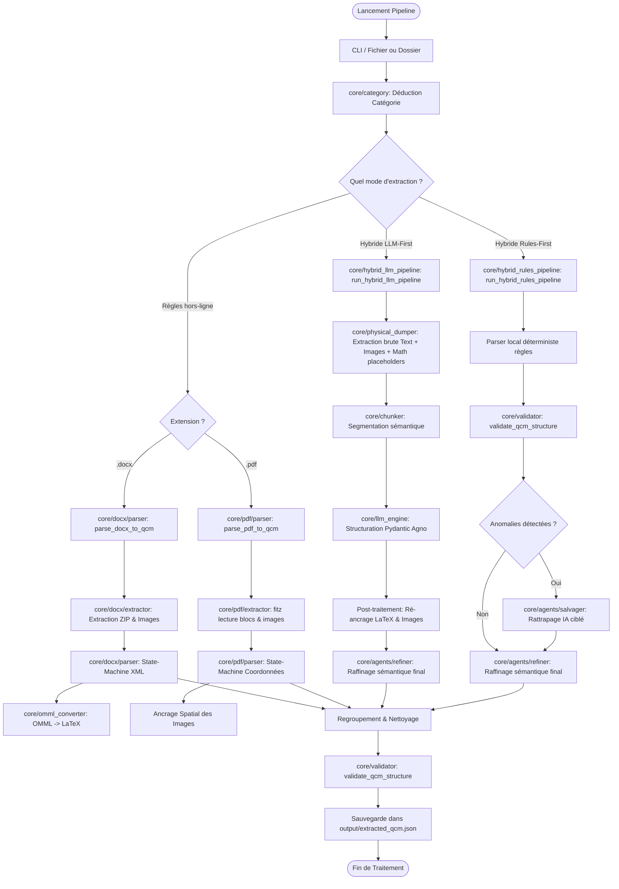

# 🧬 MedExtract-API - Extraction Core (Épique 01 & 02)

**MedExtract-API** est une pipeline d'extraction de haute précision conçue pour automatiser la conversion de banques de QCM médicales (depuis des fichiers Word `.docx` et PDF complexes) vers une base de données structurée au format JSON. 

Ce système repose sur une architecture découplée respectant strictement le principe de responsabilité unique (SRP), combinant des parsers déterministes par règles hors-ligne et un moteur sémantique basé sur des agents LLM (Agno) pour garantir l'intégrité totale des énoncés, des formules biologiques (LaTeX) et des illustrations médicales.

---

## 🏗️ Architecture du Projet

Le projet adopte une architecture modulaire propre et découplée pour isoler les tâches d'extraction physique des données de la logique métier (parsing des QCM et structuration).

```mermaid
graph TD
    %% CLI / Orchestration
    subgraph SG1 ["1. Orchestration & Routeurs"]
        A[main.py: CLI Orchestrator]
        APP[app/app_relecture.py: Streamlit Entrypoint]
        B[core/category.py: Category Deducer]
        C[core/validator.py: QCM Validator]
        
        A --> B
        A --> C
        APP --> C
    end

    %% Streamlit Components
    subgraph SG1_UI ["1b. Streamlit UI Components"]
        UI_SIDE[app/components/sidebar.py]
        UI_VIEW[app/components/context_viewer.py]
        UI_FORM[app/components/editor_form.py]
        UI_STYLE[app/components/styles.py]
        
        APP --> UI_SIDE
        APP --> UI_VIEW
        APP --> UI_FORM
        APP --> UI_STYLE
    end

    %% Processing Pipelines
    subgraph SG2 ["2. Extraction Pipelines"]
        HR[core/hybrid_rules_pipeline.py: Rules-First Hybrid]
        HL[core/hybrid_llm_pipeline.py: LLM-First Hybrid]
        ED[core/docx: DOCX Parser package]
        EP[core/pdf: PDF Parser package]
        
        A --> HR
        A --> HL
        APP --> HR
        APP --> HL
        HR --> ED
        HR --> EP
    end

    %% Helpers & Preprocessors
    subgraph SG3 ["3. Shared Engine Helpers"]
        G[core/omml_converter.py: OMML to LaTeX]
        H[core/utils.py: Shared Helpers]
        I[core/config.py: Centralized Config & Regex]
        DUMP[core/physical_dumper.py: Raw Markdown Dumper]
        POST[core/post_processor.py: Common Post-processor]
        
        HL --> DUMP
        ED --> G
        ED --> H
        EP --> H
        I --> ED
        I --> EP
        HR --> POST
        HL --> POST
    end

    %% AI & Agents Subsystem
    subgraph SG4 ["4. AI & Agent Subsystem"]
        M[core/models.py: Pydantic Schemas]
        L[core/llm_engine.py: Agno Client]
        
        subgraph AG ["core/agents: Agno Agents package"]
            R[core/agents/refiner.py: Logic Refinement]
            S[core/agents/salvager.py: Structural Recovery]
            P[core/agents/pairer.py: Semantic Pairing]
        end
        
        HL --> L
        POST --> L
        L --> M
        R --> L
        S --> L
        P --> L
    end

    %% Outputs
    subgraph SG5 ["5. Output Storage"]
        OUT_IMG[(output/images/)]
        OUT_JSON[output/extracted_qcm.json]
        
        ED -.-> OUT_IMG
        EP -.-> OUT_IMG
        DUMP -.-> OUT_IMG
        A -.-> OUT_JSON
        APP -.-> OUT_JSON
    end
```



---

## 🔍 Logique Interne des Services

Chaque module au sein du projet répond à une responsabilité unique :

### 1. Orchestration & Interfaces
*   **[main.py](file:///c:/Users/redab/Desktop/ProjetWordMedicale/main.py) (CLI Orchestrator)** : Point d'entrée en ligne de commande. Gère les arguments, configure les chemins, déduit la catégorie et délègue le travail aux pipelines correspondantes.
*   **[app/app_relecture.py](file:///c:/Users/redab/Desktop/ProjetWordMedicale/app/app_relecture.py) (Streamlit App)** : Routeur principal de l'interface graphique de relecture humaine.
*   **`app/components/`** :
    *   `styles.py` : CSS personnalisé premium-dark pour l'interface.
    *   `sidebar.py` : Téléversement, sélection de fichiers, modes et contrôles de navigation.
    *   `context_viewer.py` : Affiche le dossier clinique et les images associées.
    *   `editor_form.py` : Formulaire interactif d'édition de QCM avec boutons de sauvegarde locale et publication API.

### 2. Pipelines d'Extraction
*   **[core/hybrid_rules_pipeline.py](file:///c:/Users/redab/Desktop/ProjetWordMedicale/core/hybrid_rules_pipeline.py) (Rules-First Hybrid)** : Pipeline par défaut. Parse d'abord localement via règles déterministes (rapide, conserve les ancres), valide la structure, puis lance des appels micro-agents de rattrapage (Gemini) ciblés sur les anomalies détectées.
*   **[core/hybrid_llm_pipeline.py](file:///c:/Users/redab/Desktop/ProjetWordMedicale/core/hybrid_llm_pipeline.py) (LLM-First Hybrid)** : Pipeline adaptative. Extrait tout le texte et les binaires d'images via le dumper, fragmente en chunks, soumet à l'agent sémantique Agno de structuration globale, puis ré-ancre localement les équations mathématiques LaTeX préservées et résout les images.

### 3. Packages Parsers Locaux
*   **[core/docx/](file:///c:/Users/redab/Desktop/ProjetWordMedicale/core/docx/)** :
    *   `extractor.py` : Extraction de l'archive ZIP, parsing OMML et lecture des relations média Word.
    *   `helpers.py` : Analyse de structure des tableaux de corrections Word et détection des annotations d'examens.
    *   `parser.py` : Machine à états de parsing linéaire DOCX épurée.
*   **[core/pdf/](file:///c:/Users/redab/Desktop/ProjetWordMedicale/core/pdf/)** :
    *   `extractor.py` : Extraction spatiale de texte et images géométriques via PyMuPDF (`fitz`).
    *   `preprocessor.py` : Reconnexion de lignes et chiffres scindés par colonnes dans le PDF.
    *   `corrections.py` : Parsing et découpage des explications de corrections intercalées ou en grille.
    *   `parser.py` : Machine à états de parsing linéaire PDF épurée.

### 4. Sous-système IA & Post-traitement
*   **[core/models.py](file:///c:/Users/redab/Desktop/ProjetWordMedicale/core/models.py)** : Centralise l'ensemble des schémas Pydantic partagés (`MedExtractQuestion`, `Option`, `Correction`, etc.).
*   **[core/llm_engine.py](file:///c:/Users/redab/Desktop/ProjetWordMedicale/core/llm_engine.py)** : Client bas niveau d'appels aux LLMs Agno (Gemini/OpenAI) gérant le backoff exponentiel et la bascule automatique vers `gemini-flash-lite-latest` en cas d'épuisement de quota (erreur 429).
*   **`core/agents/`** :
    *   `refiner.py` : Agent de qualification sémantique des propositions K-Type (`is_true`) et des directions logiques (`logic_type`).
    *   `salvager.py` : Agent de restructuration pour les propositions orphelines ou mal alignées.
    *   `pairer.py` : Agent de corrélation sémantique robuste pour coupler énoncés et commentaires cliniques.
*   **[core/post_processor.py](file:///c:/Users/redab/Desktop/ProjetWordMedicale/core/post_processor.py)** : Nettoyage global post-parsing (normalisation des types de questions, dédoublonnage d'options et détection des extensions d'images réelles).

### 5. Modules Utilitaires Partagés
*   **[core/omml_converter.py](file:///c:/Users/redab/Desktop/ProjetWordMedicale/core/omml_converter.py)** : Traducteur récursif d'Office Math XML en LaTeX.
*   **[core/category.py](file:///c:/Users/redab/Desktop/ProjetWordMedicale/core/category.py)** : Déduction de spécialité médicale d'après le nom du fichier.
*   **[core/validator.py](file:///c:/Users/redab/Desktop/ProjetWordMedicale/core/validator.py)** : Validateur structurel mesurant la conformité des questions extraites.
*   **[core/config.py](file:///c:/Users/redab/Desktop/ProjetWordMedicale/core/config.py)** : Fichier de configuration et de Regex centralisées.

---

## 📊 Diagrammes de Scénarios et Flux

### 1. Diagramme de Flux de Traitement d'un Document
Ce diagramme montre le cheminement de traitement d'un fichier du début à la fin de la pipeline selon le mode d'extraction choisi :



---

## 🚀 Utilisation de la Pipeline

### Prérequis
*   Python 3.13+
*   Dépendances installées dans l'environnement virtuel local `.venv/` (`PyMuPDF`, `lxml`, `python-docx`, `agno`, `google-genai`, `streamlit`).

### Mode 1 : Extraction par Règles (Hors-ligne)
Ce mode n'effectue aucun appel réseau (pas d'IA) et s'appuie uniquement sur les parsers déterministes :
```bash
# Extraction rules-only d'un fichier DOCX
.venv\Scripts\python.exe main.py --file "QCM Medicale/Uploaded/Qcms.docx" --rules
```

### Mode 2 : Extraction Hybride Coopérative (Rules-First) [Par défaut] 🌟
Le mode le plus rapide avec intervention de l'IA uniquement en cas de besoin :
```bash
# Analyse locale + micro-rattrapage ciblé sur les anomalies détectées par le validateur
.venv\Scripts\python.exe main.py --file "QCM Medicale/Uploaded/Qcms.docx" --hybrid-rules
```

### Mode 3 : Extraction Hybride Auto-Adaptative (LLM-First)
Le mode le plus robuste face à des structures de documents complexes ou mal formatées :
```bash
# Extraction physique + structuration sémantique complète par l'IA + ré-ancrage LaTeX/images
.venv\Scripts\python.exe main.py --file "QCM Medicale/Uploaded/Qcms.docx" --hybrid-llm
```

---

## 📈 Métriques et Résultats Actuels

Le système a été évalué sur le corpus d'examens médicaux réels :

### 1. Résultats sur le Jeu de Données Validé (`FileAlreadyTested`)
*   **Total de fichiers traités** : **14 fichiers** (mélange de DOCX et PDF)
*   **Total de questions extraites** : **447 QCMs**
*   **Total de questions validées** : **447 QCMs** (100% de taux de conformité après rattrapage hybride).
*   **Images médicales associées** : **91 images** associées et validées dans le JSON final.

### 2. Résultats sur le Jeu de Données Complexe (`Qcms.docx`)
*   **Total de questions extraites** : **148 QCMs**
*   **Total de questions validées** : **148 / 148 QCMs**
*   **warnings de structure** : **0 🟢** (aucune anomalie résiduelle après raffinement logique par l'agent).
