# 🗺️ Plan de Perspective et d'Évolution Technologique (MedExtract-API)

## 🎯 Problématique Centrale
Actuellement, chaque nouveau document QCM soumis au système nécessite des ajustements réguliers du code Python. Cela est dû au fait que le **premier niveau de traitement** repose sur un parser déterministe hors-ligne rigide (regex, machine à états), sensible aux moindres variations de mise en forme (espaces, types de puces, tableaux complexes). 

Ce document détaille la **meilleure solution d'intégration de l'IA** pour rendre le parsing flexible et insensible aux variations visuelles, tout en conservant la précision chirurgicale du traitement des formules scientifiques (LaTeX) et des images.

---

## 💡 La Solution Recommandée : Le Pipeline Hybride "LLM-First"

Pour obtenir un système qui s'adapte automatiquement à n'importe quel format sans modification de code, nous devons inverser l'ordre des responsabilités : **confier la structuration globale à l'IA en premier niveau, tout en conservant les outils déterministes locaux pour les formules et les images.**

### 🔄 Inversion des Responsabilités

```mermaid
graph TD
    %% Architecture Actuelle
    subgraph SG1 ["Architecture Actuelle (Fragile)"]
        A1[Fichier Word/PDF] --> B1[Parser déterministe local]
        B1 -->|Erreurs de structure / Regex brisées| C1[Validateur & Anomalies]
        C1 --> D1[Rattrapage & Raffinage IA]
        D1 --> E1[JSON Final]
    end

    %% Architecture LLM-First Recommandée
    subgraph SG2 ["Architecture LLM-First (Généralisée)"]
        A2[Fichier Word/PDF] --> B2[Extraction physique brute : plain-text + tags + images]
        B2 --> C2[Structuring Agent : IA structure directement le texte]
        C2 --> D2[Post-processeur local : LaTeX & Images]
        D2 --> E2[JSON Final]
    end
    
    style SG1 fill:#ffe3e3,stroke:#ff8080
    style SG2 fill:#e3ffe3,stroke:#80ff80
```

---

## 🛠️ Plan d'Implémentation Détaillé

### Étape 1 : Simplification des Parsers Physiques (Le "Text Dumper")
Nous éliminons les machines à états complexes et les regex de [core/docx/parser.py](file:///c:/Users/redab/Desktop/ProjetWordMedicale/core/docx/parser.py) et [core/pdf/parser.py](file:///c:/Users/redab/Desktop/ProjetWordMedicale/core/pdf/parser.py). Leur unique rôle devient :
1.  Extraire l'arbre XML (DOCX) ou la structure spatiale (PDF).
2.  Générer un fichier texte unique au format Markdown simplifié.
3.  Injecter des placeholders très simples pour les formules mathématiques et les images :
    *   Formules : `[[MATH_OMML_01]]` (converties localement en LaTeX de manière sûre).
    *   Images : `[[IMG_rId12]]` (extraites et sauvegardées localement de manière sûre).

### Étape 2 : Structuration Sémantique par l'Agent IA
Le document Markdown plat avec ses placeholders est segmenté et envoyé à un agent de structuration IA.
*   **Prompt de l'Agent** : L'IA reçoit le texte et le schéma de sortie Pydantic.
*   **Flexibilité totale** : L'IA ignore si l'option commence par `A.`, `A)`, `A :`, ou si elle est sur une ou plusieurs lignes. Elle comprend naturellement la structure linguistique d'un QCM médical.
*   **Consistance logique** : L'IA extrait directement la clé de correction à partir des commentaires cliniques et peuple les champs `logic_type` et les statuts des assertions `K_TYPE` en une seule passe.

### Étape 3 : Post-Processing et Ré-alignement Local
Une fois le JSON structuré retourné par l'IA, un script Python local rapide effectue le ré-alignement physique :
1.  **Ré-ancrage des images** : Remplace les placeholders d'images par leurs fichiers physiques réels.
2.  **Remplacement LaTeX** : Ré-injecte les formules LaTeX converties à l'étape 1 dans les énoncés nettoyés par l'IA.

---

## 📊 Tableau Comparatif des Stratégies

| Critères | Approche Actuelle (Hybride "Rules-First") | Approche LLM-First (Recommandée) |
| :--- | :--- | :--- |
| **Sensibilité au formatage** | **Très élevée** (nécessite des modifications de regex régulières) | **Nulle** (l'IA comprend n'importe quelle disposition textuelle) |
| **Robustesse des Formules & Images** | Excellente (déterministe locale) | Excellente (déterministe locale ré-injectée) |
| **Temps de développement** | Élevé (maintenance continue du code de parsing) | Faible (un seul prompt robuste et stable à maintenir) |
| **Consommation API & Coût** | Moyenne (uniquement sur les questions en anomalie) | Légèrement plus élevée (traitement de tout le texte par l'IA) |
| **Fiabilité logique (RJ/RF)** | Élevée (raffinage en bout de chaîne) | Maximale (structuration et raffinage simultanés) |

---

## 🚀 Conclusion et Prochaine Action
L'approche **LLM-First** est la seule solution viable pour obtenir un système véritablement généralisé qui ne nécessite pas d'intervention humaine pour chaque nouveau format d'examen. 

Elle s'intègre parfaitement avec le validateur et les modèles Pydantic que nous avons déjà implémentés dans [core/hybrid_refiner.py](file:///c:/Users/redab/Desktop/ProjetWordMedicale/core/hybrid_refiner.py) et permet de nettoyer définitivement la base de code des regex et automates fragiles.
